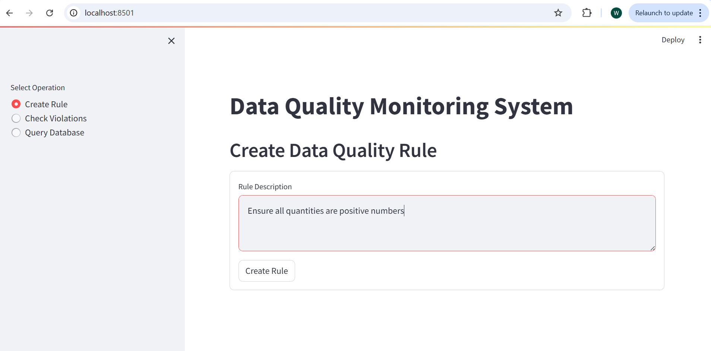
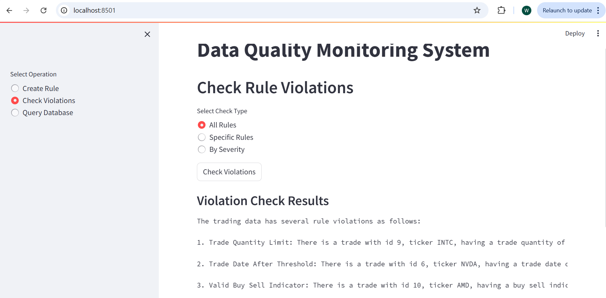
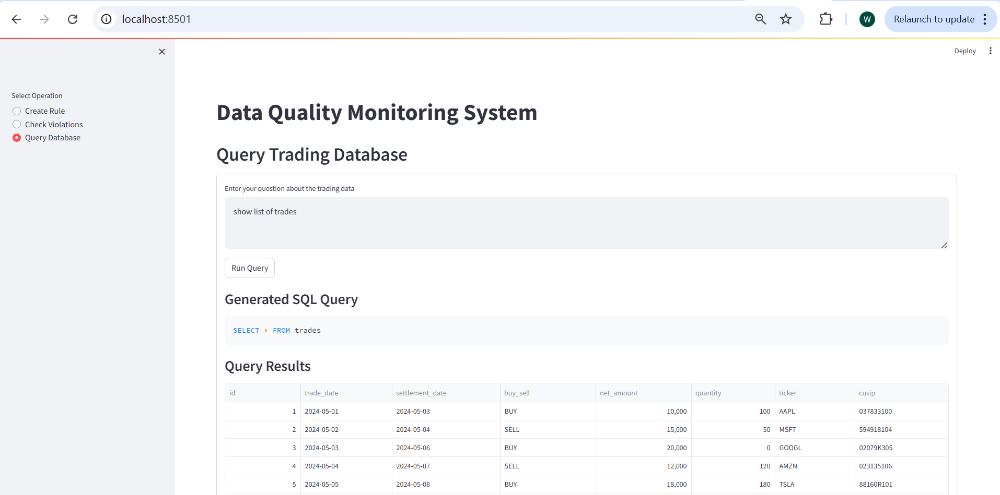
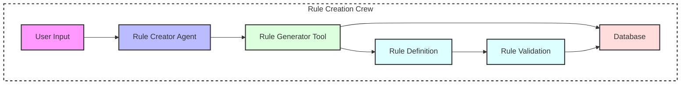
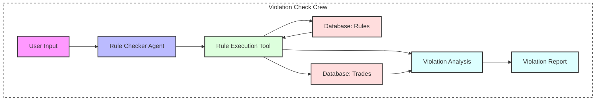

# Data Quality Monitoring System with Agentic AI

A sophisticated data quality monitoring system that leverages Agentic AI and CrewAI to maintain data quality rules and monitor trading data violations. The system uses natural language processing to create and manage SQL-based data quality rules, check for violations, and perform ad-hoc queries against trading data.

## Project Overview

This project demonstrates the power of Agentic AI in maintaining data quality by:
- Creating data quality rules using natural language descriptions
- Storing rules in a structured database
- Checking for violations across all or specific rules
- Performing natural language queries against trading data
- Providing an intuitive UI for all operations

## Running the Code

### Using the Streamlit UI (Recommended)

The Streamlit UI provides a user-friendly interface for all functionality:

```bash
# Install dependencies
pip install -r requirements.txt

# Run the Streamlit app
streamlit run app.py
```

The UI offers three main operations:
1. **Create Rule**: Define new data quality rules using natural language
2. **Check Violations**: Run violation checks against existing rules
3. **Query Database**: Perform ad-hoc queries using natural language

### Running Individual Python Files

For development or testing specific components:

```bash
# Create new rules
python create_rule.py

# Check for violations
python check_violations.py

# Run ad-hoc queries
python generic_query.py
```

Use individual files when:
- Developing new features
- Testing specific components
- Debugging issues
- Running batch operations

## User Interface

### Create Rule Page

The Create Rule interface allows users to:
- Enter natural language descriptions of data quality rules
- View the generated SQL query
- See rule details including severity and description
- Get immediate feedback on rule creation

### Check Violations Page

The violations checking interface provides:
- Options to check all rules or filter by specific criteria
- Clear violation reports with affected records
- Ability to filter rules by severity
- Interactive selection of specific rules to check

### Query Database Page

The query interface enables:
- Natural language queries against trading data
- Display of the translated SQL query
- Interactive table view of results
- Text display for aggregated results

## Database Design

The system uses two main tables to store trading data and data quality rules:

### Trades Table
The main table storing trading transaction data:

| Column | Type | Description |
|--------|------|-------------|
| id | int NOT NULL AUTO_INCREMENT | Primary key, unique identifier for each trade |
| trade_date | date NOT NULL | Date when the trade was executed |
| settlement_date | date NOT NULL | Date when the trade settles |
| buy_sell | varchar(10) NOT NULL | Trade direction (BUY/SELL) |
| net_amount | decimal(15,2) NOT NULL | Total value of the trade |
| quantity | int NOT NULL | Number of units traded |
| ticker | varchar(20) NOT NULL | Trading symbol |
| cusip | varchar(20) NOT NULL | CUSIP identifier for the security |

Sample Data:
```sql
id | trade_date  | settlement_date | buy_sell | net_amount  | quantity | ticker | cusip
----|------------|----------------|----------|-------------|----------|--------|--------
1   | 2024-05-30 | 2024-06-01    | BUY      | 15025.00    | 100      | AAPL   | 037833100
2   | 2024-05-30 | 2024-06-01    | SELL     | 125037.50   | 50       | GOOGL  | 02079K107
3   | 2024-05-30 | 2024-06-01    | BUY      | 24412.50    | 75       | MSFT   | 594918104
```

### Rules Table
Stores data quality rules and their definitions:

| Column | Type | Description |
|--------|------|-------------|
| rule_id | int NOT NULL AUTO_INCREMENT | Primary key, unique identifier for each rule |
| rule_name | varchar(255) NOT NULL | Short descriptive name of the rule |
| rule_description | text NOT NULL | Detailed description of what the rule checks |
| rule_text | text NOT NULL | The actual SQL query that identifies violations |
| severity | enum('HIGH','MEDIUM','LOW') NOT NULL | Rule severity level |
| created_at | timestamp | When the rule was created |
| updated_at | timestamp | When the rule was last updated |
| is_active | tinyint(1) | Whether the rule is currently active (1) or disabled (0) |

Sample Data:
```sql
rule_id | rule_name           | rule_description                           | severity | rule_text                                              | created_at           | updated_at           | is_active
--------|--------------------|--------------------------------------------|----------|--------------------------------------------------------|---------------------|---------------------|----------
1       | Positive Quantity  | Ensures trade quantities are greater than 0 | HIGH     | SELECT * FROM trades WHERE quantity <= 0               | 2024-05-30 10:00:00 | 2024-05-30 10:00:00 | 1
2       | Valid Net Amount   | Checks if net amount matches quantity      | MEDIUM   | SELECT * FROM trades WHERE net_amount <= 0             | 2024-05-30 10:15:00 | 2024-05-30 10:15:00 | 1
3       | Settlement Check   | Validates settlement is after trade date   | HIGH     | SELECT * FROM trades WHERE settlement_date <= trade_date| 2024-05-30 10:30:00 | 2024-05-30 10:30:00 | 1
```

## Agentic AI Introduction

Agentic AI represents a paradigm shift in artificial intelligence where AI systems act as autonomous agents with specific roles, goals, and capabilities. These agents can:
- Make decisions independently
- Execute complex tasks
- Collaborate with other agents
- Learn from interactions
- Adapt to new situations

The key principle is that agents are goal-oriented and can determine the best way to achieve their objectives using available tools and capabilities.

## CrewAI Framework

CrewAI is a framework for building and orchestrating multiple AI agents that work together to accomplish complex tasks. It provides:

- **Agent Management**: Create and manage multiple specialized agents
- **Task Coordination**: Orchestrate tasks between agents
- **Tool Integration**: Integrate custom tools and capabilities
- **Workflow Management**: Define and execute multi-step workflows

## Project Architecture

### Rule Creation Workflow


### Violation Checking Workflow


### Query Workflow

```mermaid
graph TD
    subgraph Crew[Query Processing Crew]
        A[User Question] --> B[Translator Agent]
        B --> C[NL2SQL Tool]
        C --> D[SQL Query]
        D --> E[Executor Agent]
        E --> F[SQL Execution Tool]
        F --> G[Database: Trades]
        G --> H[Raw Results]
        H --> I[Executor Agent]
        I --> J[Formatted Results]
        
        %% Additional flows
        C --> K[Schema Validation]
        K --> D
    end
    
    style A fill:#f9f,stroke:#333,stroke-width:2px
    style B fill:#bbf,stroke:#333,stroke-width:2px
    style C fill:#dfd,stroke:#333,stroke-width:2px
    style D fill:#dff,stroke:#333,stroke-width:2px
    style E fill:#bbf,stroke:#333,stroke-width:2px
    style F fill:#dfd,stroke:#333,stroke-width:2px
    style G fill:#fdd,stroke:#333,stroke-width:2px
    style H fill:#dff,stroke:#333,stroke-width:2px
    style I fill:#bbf,stroke:#333,stroke-width:2px
    style J fill:#dff,stroke:#333,stroke-width:2px
    style K fill:#dff,stroke:#333,stroke-width:2px
    style Crew fill:#fff,stroke:#333,stroke-width:2px,stroke-dasharray: 5 5
```


### Color Legend
- 🟪 Pink: User Interaction
- 🟦 Blue: Agents
- 🟩 Green: Tools
- 🟥 Red: Databases
- 🟨 Light Blue: Intermediate Results/Processing
- ⬜ White (Dashed): Crew Boundary

### Key Components in Each Workflow

#### Rule Creation
- **Crew**: Orchestrates the rule creation process
- **Agent**: Rule Creator Agent interprets user requirements
- **Tool**: Rule Generator Tool creates SQL rules
- **Process**: Includes validation and database storage

#### Violation Checking
- **Crew**: Manages violation detection workflow
- **Agent**: Rule Checker Agent coordinates checking
- **Tool**: Rule Execution Tool runs rules against data
- **Process**: Includes rule retrieval and violation analysis

#### Query Processing
- **Crew**: Coordinates natural language query processing
- **Agents**: Translator and Executor agents work together
- **Tools**: NL2SQL and SQL Execution tools
- **Process**: Includes schema validation and result formatting

## Project Components

### Agents
- **Rule Creator Agent**: Creates data quality rules
- **Rule Checker Agent**: Checks for rule violations
- **SQL Translator Agent**: Converts natural language to SQL
- **SQL Executor Agent**: Executes and formats query results

### Tools
- **Rule Generator Tool**: Generates SQL-based rules
- **Rule Execution Tool**: Executes rule violation checks
- **NL2SQL Tool**: Converts natural language to SQL
- **SQL Execution Tool**: Executes SQL queries

## Frameworks and Technologies

- **CrewAI**: Agent orchestration and management
- **Streamlit**: Web-based user interface
- **SQLAlchemy**: Database interaction
- **Pandas**: Data manipulation and display
- **LangChain**: LLM integration
- **MySQL**: Data storage
- **Python**: Core programming language

## Vibe Coding

Vibe Coding represents a modern approach to software development that emphasizes:
- Natural language interaction with AI
- Rapid prototyping and iteration
- Context-aware code generation
- Intelligent error handling
- Seamless integration of AI capabilities

This project demonstrates Vibe Coding through its use of:
- Natural language rule creation
- AI-powered query translation
- Intelligent violation detection
- Context-aware code generation

## Cursor IDE

Cursor is a revolutionary IDE that integrates AI capabilities directly into the development environment. Key features include:

- **AI Code Generation**: Generate code from natural language descriptions
- **Context-Aware Completions**: Intelligent code suggestions based on context
- **Integrated Chat**: Natural language interaction with AI
- **Code Explanation**: AI-powered code documentation
- **Error Resolution**: AI-assisted debugging

### Comparison with Other AI Tools

| Feature | Cursor | GitHub Copilot | Amazon CodeWhisperer |
|---------|--------|----------------|---------------------|
| Context Understanding | Full project context | Limited to open files | Limited to open files |
| Chat Interface | Yes | No | No |
| Code Generation | Full functions/files | Line-by-line | Line-by-line |
| Error Resolution | Interactive | Limited | Limited |
| Cost | Free | Subscription | AWS tied |
| Open Source Integration | Yes | Limited | AWS focused |

## Getting Started

1. Clone the repository
2. Install dependencies: `pip install -r requirements.txt`
3. Set up environment variables in `.env`:
   ```
   OPENAI_API_KEY=your_key_here
   ```
4. Initialize the database (MySQL required)
5. Run the Streamlit UI: `streamlit run app.py`

## Contributing

Contributions are welcome! Please read our contributing guidelines and submit pull requests for any enhancements.

## License

This project is licensed under the MIT License - see the LICENSE file for details.